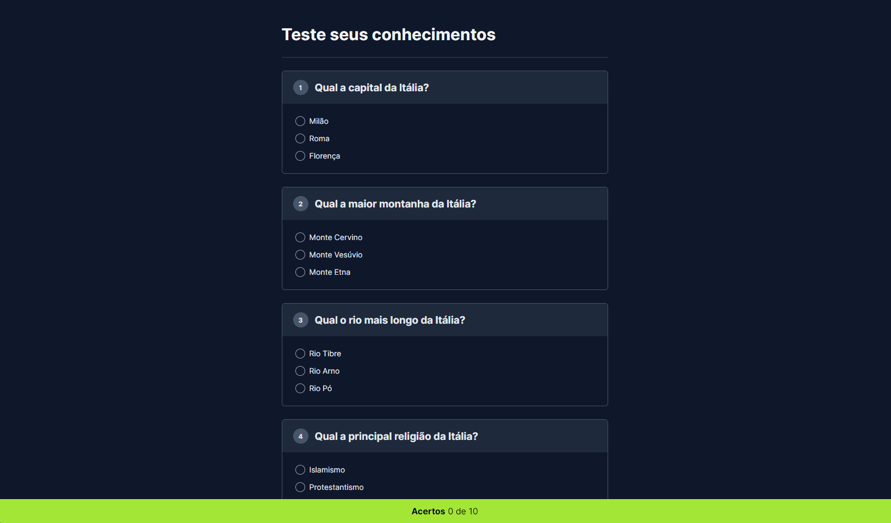

# ⁉ QuizApp

 Teste seus conhecimentos sobre a itália com um quiz de 10 perguntas, lindo e dinâmico.

## 💡 Recursos Principais
- Possibilidade de jogar um jogo de quiz.

## 🚀 Deploy
- Você pode acessar o projeto aqui:
 https://feapolina.github.io/quiz-app-js/

## 💽 Executar Localmente

Clone o projeto

```bash
  git clone https://github.com/feapolina/quiz-app-js.git
```

Vá para o diretorio do projeto

```bash
  Execute o arquivo "index.html"
```


## 🛠 Tecnologias Utilizadas

### Back end:
- Javascript, para a lógica da aplicação.

### Front end:
- HTML e CSS.


## 👨🏽‍💻 Autores:

- [@feapolina](https://github.com/feapolina)

## 💬 Feedback

Se você tiver algum feedback, entre em contato pelo email: fe.cavalcanti2016@gmail.com
